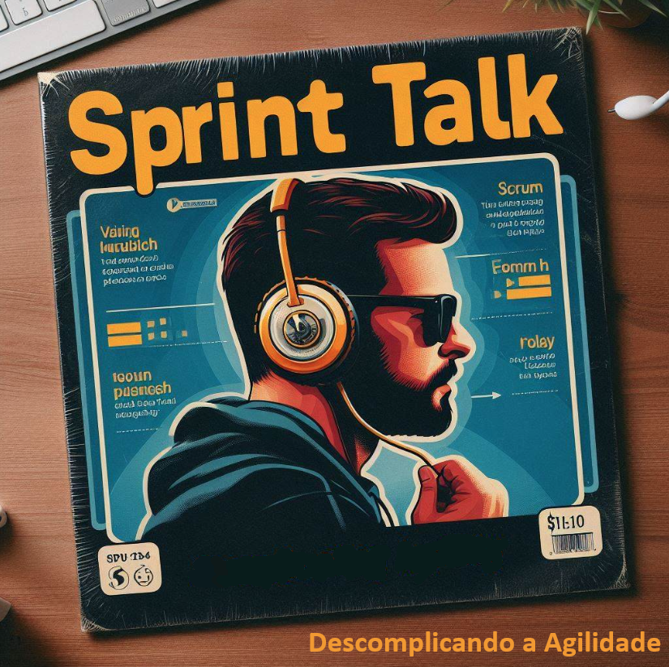

# Projeto Podcast Gerado por I.A.s

Projeto com o objetivo de gerar um podcast utilizando ferramentas de IA através de prompts mais trabalhado.

Utilizer uma esteira de prompts para gerar cada etapa do processo criativo.

## 💻 Tecnologias utilizadas no projeto

- [ChatGPT](https://chat.openai.com/) 
- [Copilot](https://copilot.microsoft.com/)
- [ElevenLabs](https://beta.elevenlabs.io/)
- [Capcut](https://www.capcut.com/pt-br/)

## ✨ Como foi feito ?

- Roteiro gerado via chatgpt
- Audio gerado pela elevenLabs
- Copilot Para gerar capa
- Capcut para tratar aúdio e adicionar sons de fundo

## 📚 Materiais

- Ep 01 na pasta output

## 🛠️ Instruções de execução

## 👨‍💻 Expert

KLEVERSON BRANDALIZE

---

⌨️ com 💜 por [Felipe Aguiar](https://github.com/felipeAguiarCode)
